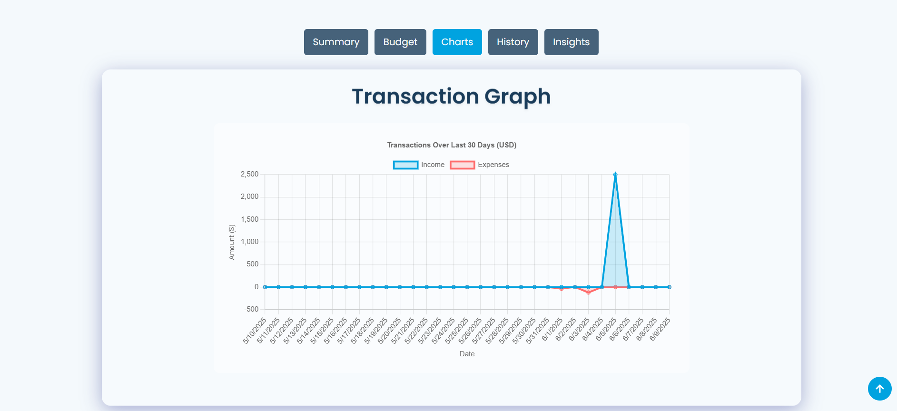
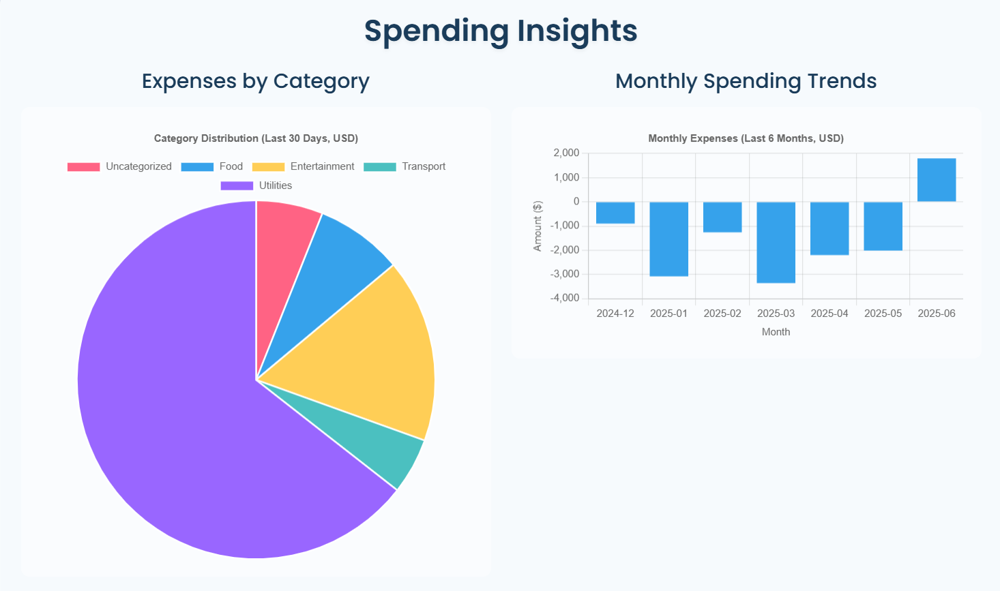
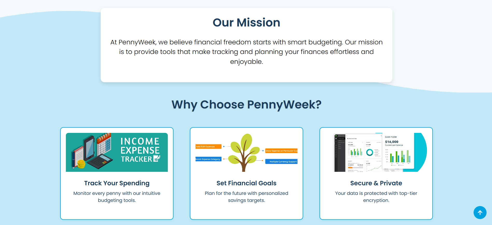

# 💸 PennyWeek

A minimalist, intuitive web application that helps you **track and manage your weekly expenses** efficiently. Designed for ease of use and clear visualization, PennyWeek empowers users to develop better financial habits.

---

## 📷 Screenshots

<!-- Add your actual screenshot image links below (local or hosted on GitHub) -->
<p align="center">
  
  
  
  
</p>

---

## 🚀 Features

- 🧾 Add, edit, and delete expenses or incomes
- 📊 Weekly & monthly expense summaries
- 📁 Categorized transactions (Food, Transport, Utilities, etc.)
- 🔍 Filter and search through transactions
- 🛡️ Secure login & registration system
- 🌙 Clean and responsive UI 

---

## 🛠️ Tech Stack

**Frontend:**
- React.js
- BootStrap
- Framer Motion
- React Router DOM

**Backend:**
- Node.js
- Express.js
- MongoDB + Mongoose

**Tools & Utilities:**
- Axios
- JWT Authentication
- Multer (for uploads)
- Git & GitHub

---

## ⚙️ Installation

```bash
# Clone the repository
git clone https://github.com/khuushiie/PennyWeek.git
cd PennyWeek

# Install frontend dependencies
cd frontend
npm install

# Install backend dependencies
cd ../backend
npm install
